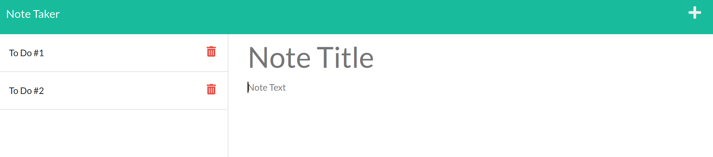

# Note Taker

## Description
An application that allows the user to add and delete notes. Saved notes are displayed on a sidebar.





## Installation
After cloning, install dependencies with the following command:
```shell
npm i
```

Start the server with:

```shell 
node server
```
This program runs on localhost port 3001.

## Testing
[Insomnia](https://insomnia.rest/) was used in testing. No route is yet included for searching specific note IDs. 

